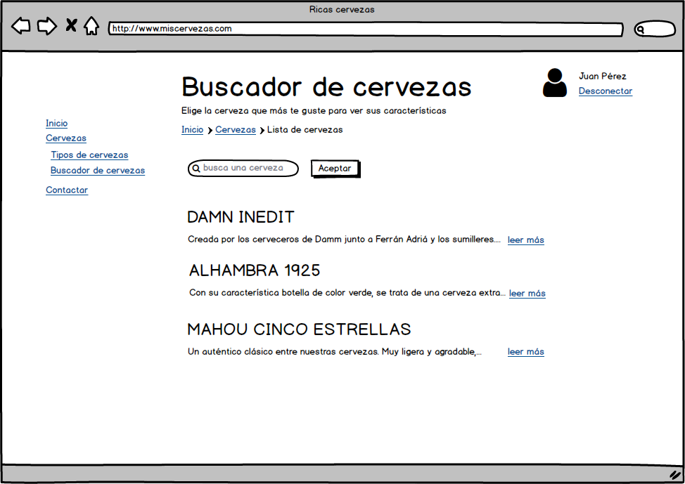

# React


# ¿Por qué React?


## Popularidad

- [Lo demanda el mercado](https://www.hntrends.com/2018/jun-no-signs-of-slowing-for-react.html?compare1=React&compare2=AngularJS&compare3=Angular+2&compare4=Vue)

- Gran comunidad
  - Stackoverflow
  - Librerías de terceros


- Muchas empresas
    - Facebook, WhatsApp, Instagram
    - Uber
    - Khan Academy
    - Airbnb
    - Dropbox
    - Netflix
    - PayPal


## A nivel técnico

- Excelente rendimiento: Virtual DOM

- Componentes reusables
  - Y existen muchos componentes

- Curva de aprendizaje pequeña
  - Fácil escribir con JSX
  - No salimos del estándar ES2015 y más allá


## Concepto de react

- Se considera la V en un modelo MVC
- Cada vista está constituida por componentes
  - Header
  - Footer
  - LogInForm
  - ...
- Cada componente se puede reutilizar en:
  - Otra vista 
  - Otra aplicación


## Instalación de paquetes

- Trabajaremos con el ecosistema node:
  - Instalaremos node, npm a través de nvm
  - Se puede usar [yarn](www.yarnpkg.com) como gestor de paquetes en vez de npm


## Ventajas de yarn
- Instantánea de versiones mediante *yarn.lock*
- Instalar dependencias en paralelo
  - Mayor rapidez
- Se empezó a usar mucho en el ecosistema React
  - React viene de Facebook y yarn también
- Con npm v6 no se aprecian ventajas

```bash
npm i -g yarn
yarn --version
```


# Introducción React y JSX


## Scripts de React

- No usaremos webpack
- [CDN relacionado con los paquetes de npm](https://unpkg.com)

  ```js
  unpkg.com/:package@:version/:file
  ```

- [Utilizaremos CDN](https://reactjs.org/docs/cdn-links.html)

  ```html
  <script crossorigin src="https://unpkg.com/react@16/umd/react.production.min.js"></script>
  <script crossorigin src="https://unpkg.com/react-dom@16/umd/react-dom.production.min.js"></script>
  ```


# Esqueleto

```html
<!DOCTYPE html>
<html>

<head>
  <meta charset="UTF-8">
  <title>Código inicial</title>
</head>

<body>
  <div id="app"></div>
  <script crossorigin src="https://unpkg.com/react@16/umd/react.production.min.js"></script>
  <script crossorigin src="https://unpkg.com/react-dom@16/umd/react-dom.production.min.js"></script>
  <script src="/scripts/app.js"></script>
</body>

</html>
```


## Estructura html

- Cargamos los siguientes scripts:

  - React y React-dom

- Generarán dos variables en el objeto Window:

  - React y   ReactDOM

- El segundo script está asociado a la web
  - No es necesario si trabajamos con VR ([react-360](https://facebook.github.io/react-360/))
  - No es necesrio con móviles ([react native](https://facebook.github.io/react-native/))


## Linter
- Para usar eslint, utilizaremos node:

  ```js
  npm init
  npm i -D eslint
  npx eslint --init
  ```

- Yo elijo standard


## Babel

- Es un compilador de JavaScript
  - Escribimos código JavaScrit de última generación
  - Babel lo traduce a código ES5
- Prueba a escribir código [en su web](https://babeljs.io/) y observa su traducción


## Hola Mundo mediante js

```js
console.log('App running')

const p = document.createElement('p') // Creamos un elemento párrafo
const text = document.createTextNode('Hola Mundo') // Creamos un nodo de tipo texto
p.appendChild(text) // Añadimos el texto al párrafo>
const appRoot = document.getElementById('app')
appRoot.appendChild(p)
```


## ¿Qué tenemos?

- Inyección de código html a partir de creación y relación de nodos
- Puede haber muchos nodos y se puede volver complejo


## ¿Qué nos gustaría?

- Elegir un nodo (app)
- Inyectar directamente el código dentro del nodo como si fuera código *html*
- ¡JSX al rescate!


## Lenguaje JSX

- JSX denota una ampliación de JavaScript a JavaScript con XML
  - Facilita el uso de templates

```js
/* global ReactDOM */
console.log('Aplicación en ejecución')

var template = <p>¡Hola Mundo!</p>
var appRoot = document.getElementById('app')
ReactDOM.render(template, appRoot)
```


## Necesitamos Babel

- Si ejecutamos en un navegador vemos que la definición del template da error:

```js
  var template = <p>¡Hola Mundo!</p>
  Unexpected token <
```

- No es código JavaScript
- Es una extensión (JSX) que nosotros debemos compilar previamente a JS para que funcione
- De eso se encarga Babel con el preset adecuado (react)


## Usar Babel

- Traduce el código anterior mediante Babel y comprueba que funcione en el navegador:

```js
/* global ReactDOM */
console.log('Aplicación en ejecución')

var template = <p>¡Hola Mundo!</p>
var appRoot = document.getElementById('app')
ReactDOM.render(template, appRoot)
```


## Resultado Babel

- Este es el código que deberíamos poner en el fichero _app.js_:

```js
/* global React, ReactDOM */
'use strict'

console.log('Aplicación en ejecución')

var template = React.createElement('p', null, '\xA1Hola Mundo!')
var appRoot = document.getElementById('app')
ReactDOM.render(template, appRoot)
```


## Uso automático de Babel

- Objetivos:
  - Escribir JSX y que se traduzca a código JavaScript
  - Escribir ES2015 y posterior y que se traduzca a ES5
  - ¡Qué sea automático!


## Plugins de Babel

- Babel está compuesto por un conjunto de plugins
- Cada plugin se encarga de hacer una traducción determinada
- [Plugin de funciones flecha](https://www.npmjs.com/package/babel-plugin-transform-es2015-arrow-functions)
- Se puede volver un poco locura seleccionar los plugins necesarios para traducir nuestro código a ES5
  - Utilizaremos **presets**
    - Son colecciones de plugins agrupados de forma lógica


## Presets de Babel

- Conjunto de plugins que hacen que Babel nos de una funcionalidad determinada.
- Nos facilitan la selección de los plugins
- Utilizaremos
  - **react**: que da acceso a JSX
  - **env**: da acceso a ES2015, ES2016 y ES2017


## Organización del proyecto

- Creamos carpeta *public* para el proyecto final
  - Fichero *index.html* en la carpeta public
  - Solo modificaremos los js
- Creamos carpeta *public/scripts* para los js en ES5
- Nuestros fuentes en el directorio *src* 
  - Fichero *app.js*


## Dependencias

- babel para compilación a ES5
- [live-server](https://www.npmjs.com/package/live-server) para visualización

  ```bash
  npm i -D babel-cli
  npm i -D babel-preset-react babel-preset-env
  npm i -D live-server
  ```


## Configuración del workflow

- liveserver coge los cambios y los muestra de forma automática en el navegador
- babel observa los cambios y compila para que liveserver los muestre en tiempo real (--watch o -w)

- npm scripts en *package.json*:
  ```bash
    "build": "babel -w src/app.js --out-file public/scripts/app.js  --presets=env,react",
    "start": "live-server ./public",
    "start-dev": "npm run build & npm start
  ```


## Ejecución y parada del proyecto

- Mediante dos comandos:

  ```bash
    npm run build
    npm start
  ```

- De una sola vez:

  ```bash
  npm run start-dev
  ```


## Explorar JSX

- [Instalamos Babel JavaScript](https://marketplace.visualstudio.com/items?itemName=mgmcdermott.vscode-language-babel)
  - Mejora colores sintáxis

- Escribiremos el código con paréntesis y salto de línea para mejor lectura:

  ```jsx
  const template = (
    <div>
      <h1>Lista de tareas</h1>
      <p>Pendientes:</p>
      <ol>
        <li>Planchar</li>
        <li>Comprar leche</li>
      </ol>
    </div>
  )
  ```


## Uso de expresiones

```js
const user = {
  name: 'Pepe',
  age: 30,
  city: 'Zaragoza'
}
const template = (
  <div>
    <h1>{user.name}</h1>
    <p>Age: {user.age}</p>
    <p>City: {user.city}</p>
  </div>
)
```


## Uso de condicionales

```js
const user = {
  name: 'Pepe',
  age: 30,
  city: 'Zaragoza'
}
function getCity (city) {
  if (city) {
    return <p>Ciudad: {city}</p>
  }
}
const template = (
  <div>
    <h1>{user.name ? user.name : 'Desconocido'}</h1>
    {user.age && user.age >= 18 && <p>Edad: {user.age}</p>}
    {getCity(user.city)}
  </div>
)
```


## Crear un header

- Crea un template para header con las siguientes propiedades:
  - title: *Añadir cervezas*
  - subtitle: *Usa el formulario para añadir tus cervezas preferidas*
- Crea un template que muestre:
  - El título mediante etiqueta h1
  - El subtítulo en caso de existir, mediante etiqueta de párrafo


## Solución header

- ¡Ojo, en principio se necesita una etiqueta que haga de wrapper!

```js
/* global ReactDOM */

const header = {
  title: 'Añadir cervezas',
  subtitle: 'Usa el formulario para añadir tus cervezas preferidas'
}

const template = (
  <header>
    <h1>{header.title}</h1>
    {header.subtitle ? <p>{header.subtitle}</p> : ''}
  </header>
)

var appRoot = document.getElementById('app')
ReactDOM.render(template, appRoot)
```


## Var, const y let

- Redeclarar variables
  - Es posible con var (let y const no dejan)
  - La compilación de lo siguiente en babel dará error:

  ```js
  let nombre = 'pepe'
  let nombre = 'pepe'
  ```


## Ambito de scope

- var dentro de funciones
- let y const dentro de llaves
  - Por eso definimios firstName fuera del if

  ```js
  const fullName = 'Pedro Pérez'
  let firstName

  if (fullName) {
    firstName = fullName.split(' ')[0]
    console.log(firstName)
  }
  console.log(firstName)
  ```


## Funciones tradicionales

- Forma tradicional:

```js
function square(x) {
  return x * x;
}
console.log(square(3));
```


- La función podría ser anónima
  - En este caso la guardamos en una variable para poder usarla

```js
const square = function (x) {
  return x * x;
};
console.log(square(3));
```


## Arrow functions

- Son funciones anónimas
  - En caso de usarlas posteriormente, hay que asignarlas a una variable
- Los parámetros van entre parentesis
  - Si hay un solo parametro puede ir sin paréntesis
  - Si no hay parámetros hay que poner paréntesis sin argumentos

  ```js
  const square = x => {
    return x * x
  }
  console.log(square(3))
  ```


- Arrow functions simplificadas:
  - Se quitan las {} y el return va implícito
    ```js
    const square = (x) => x * x

    console.log(square(3))
    ```
  - Si se devuelve un json, se deben añadir paréntesis:
    ```js
    const square = (x) => ({doble: x * x})
    ```


## Conversión a arrow functions

- Crea una arrow function que devuelva la primera parte de un nombre completo

```js
getFirstName('Pedro Pérez') -> "Pedro"
// Create regular arrow function
// Create arrow function using shorthand syntax
```


## Solución arrow function

```js
const getFirstName = fullName => fullName.split(' ')[0]
console.log(getFirstName('Pedro Pérez'))
```


## arguments

- No se pude acceder al array de arguments desde las arrow functions:

```js
const add = (a, b) => {
  // console.log(arguments)
  return a + b
};
console.log(add(55, 1, 1001))
```


## this

- Se comporta algo diferente en JavaScript respecto a otros lenguajes
  - Su valor depende de como se ha llamado, del contexto de la función
- Usando arrow funcions siempre depende del elemento superior
- Conclusiones:
  - Normalmente se deben utilizar arrow funcions
  - Pero en ocasiones no


## Ejemplo uso this

- ¿Funcionará el siguiente código?
  - ¿Sabes arreglarlo en caso de que no funcione?

```js
const user = {
  name: 'Pepe',
  cities: ['Zaragoza', 'Madrid', 'Lérida'],
  showCities: function () {
    this.cities.forEach(function (city) {
      console.log(`${this.name} ha vivido en ${city}\n`)
    })
  }
}
```


## Resultado

- La variable this no tiene valor en el console.log

```js
app.js:11 Uncaught TypeError: Cannot read property 'name' of undefined
    at app.js:11
```


## Posible solución:

```js
const user = {
  name: 'Pepe',
  cities: ['Zaragoza', 'Madrid', 'Lérida'],
  showCities: function () {
    const that = this
    this.cities.forEach(function (city) {
      console.log(`${that.name} ha vivido en ${city}\n`)
    })
  }
}
```


## Solución con Arrow funcions

```js
const user = {
  name: 'Pepe',
  cities: ['Zaragoza', 'Madrid', 'Lérida'],
  showCities: function () {
    this.cities.forEach((city) => {
      console.log(`${this.name} ha vivido en ${city}\n`)
    })
  }
}
```


## ¿Funcionará?

```js
const user = {
  name: 'Pepe',
  cities: ['Zaragoza', 'Madrid', 'Lérida'],
  showCities: () => {
    this.cities.forEach(city => {
      console.log(`${this.name} ha vivido en ${city}\n`)
    })
  }
}
```


## Solución:
- No funciona porque la función flecha coge *this* de su *parent scope*
- En este caso su *parent scope* es el *global scope* :-(
- Afortunadamente tenemos una nueva sintáxis para los métodos en las clases de ES6:

```js
const user = {
  name: 'Pepe',
  cities: ['Zaragoza', 'Madrid', 'Lérida'],
  showCities () {
    this.cities.forEach(city => {
      console.log(`${this.name} ha vivido en ${city}\n`)
    })
  }
}
```


## Eventos y atributos

- Algunos se deben reescribir
  - class -> className (class es palabra reservada en JavaScript)
- Se escriben con notación camelCase
- [Elementos que podemos usar en React](https://reactjs.org/docs/dom-elements.html)


## Ejemplo

- Completa el código siguiente para que los botones funcionen:

```js
/* global ReactDOM */
console.log('Aplicación en ejecución')

let count = 0
const addOne = () => {
  console.log('addOne')
}

const template = (
  <div>
    <h1>Count: {count}</h1>
    <button onClick={addOne}>+1</button>
    <button onClick={minusOne}>-1</button>
    <button onClick={reset}>reset</button>
  </div>
)

const appRoot = document.getElementById('app')

ReactDOM.render(template, appRoot)
```


## Solución código anterior

```js
/* global ReactDOM */
console.log('Aplicación en ejecución')

let count = 0
const addOne = () => {
  count++
}
const minusOne = () => {
  count--
}
const reset = () => {
  console.log(count)
  count = 0
}
const template = (
  <div>
    <h1>Count: {count}</h1>
    <button onClick={addOne}>+1</button>
    <button onClick={minusOne}>-1</button>
    <button onClick={reset}>reset</button>
  </div>
)

const appRoot = document.getElementById('app')

ReactDOM.render(template, appRoot)
```


## Análisis código anterior

- Los botones funcionan
- Sin embargo no se renderiza de nuevo al cambiar el valor de *count*


## Implementación del render

- Tenemos que llamar al render de forma manual
  - Al inicio de la aplicación
  - Cada vez que se pulsa un botón
- ReactDOM.render es muy eficiente:
  - Solo actualizará la parte del DOM necesaria
  - Utiliza un DOM virtual para ver diferencias
  - Actulizará solo el h1, no los botones
- ¿Lo intentas?


## Solución

```js
/* global ReactDOM */
console.log('Aplicación en ejecución')

let count = 0
const addOne = () => {
  count++
  renderApp()
}
const minusOne = () => {
  count--
  renderApp()
}
const reset = () => {
  count = 0
  renderApp()
}

const appRoot = document.getElementById('app')

const renderApp = () => {
  const template = (
    <div>
      <h1>Count: {count}</h1>
      <button onClick={addOne}>+1</button>
      <button onClick={minusOne}>-1</button>
      <button onClick={reset}>reset</button>
    </div>
  )

  ReactDOM.render(template, appRoot)
}

const appRoot = document.getElementById('app')
renderApp()
```


## Eventos

- [Lista de eventos](https://reactjs.org/docs/events.html)
- [Eventos del formulario](https://reactjs.org/docs/events.html#form-events)

```js
/* global ReactDOM */

const app = {
  title: 'Añadir cervezas',
  subtitle: 'Usa el formulario para añadir tus cervezas preferidas',
  cervezas: []
}

const onFormSubmit = e => {
  e.preventDefault()
  const cerveza = e.target.elements['cerveza'].value
  if (cerveza) {
    app.cervezas.push(cerveza)
    e.target.elements.cerveza.value = ''
    renderApp()
    console.log(app.cervezas)
  }
}

const renderApp = () => {
  const template = (
    <div>
      <header>
        <h1>{app.title}</h1>
        {app.subtitle ? <p>{app.subtitle}</p> : ''}
      </header>
      <form onSubmit={onFormSubmit}>
        <input type="text" name="cerveza" />
        <button>Añadir cerveza</button>
      </form>
    </div>
  )
  const appRoot = document.getElementById('app')
  ReactDOM.render(template, appRoot)
}

renderApp()

```


## Ejercicio: borrar lista

- Implementar un botón de borrado
- Implementar la acción del botón
  - Inicializar el array de cervezas a vacío.
  - Renderizar de nuevo

```js
const template = (
  ....
  <button onClick={onRemoveAll}>Remove All</button>
  ...
);

const onRemoveAll = () => {
  app.cervezas = []
  renderApp()
}
```


## Solución ejercicio

```js
/* global ReactDOM */

const app = {
  title: 'Añadir cervezas',
  subtitle: 'Usa el formulario para añadir tus cervezas preferidas',
  cervezas: []
}

const onFormSubmit = e => {
  e.preventDefault()
  const cerveza = e.target.elements['cerveza'].value
  if (cerveza) {
    app.cervezas.push(cerveza)
    e.target.elements.cerveza.value = ''
    renderApp()
  }
}

const onRemoveAll = e => {
  e.preventDefault()
  app.cervezas = []
  renderApp()
}

const renderApp = () => {
  console.log(app.cervezas)
  const template = (
    <div>
      <header>
        <h1>{app.title}</h1>
        {app.subtitle ? <p>{app.subtitle}</p> : ''}
      </header>
      <form onSubmit={onFormSubmit}>
        <input type="text" name="cerveza" />
        <button onClick={onRemoveAll}>Remove All</button>
        <button>Añadir cerveza</button>
      </form>
    </div>
  )
  const appRoot = document.getElementById('app')
  ReactDOM.render(template, appRoot)
}

renderApp()
```


## Uso de Arrays con JSX

- Basta con poner en el template algo como:

  ```js
  {
    ["cerveza1", "cerveza2", "cerveza3"]
  }
  ```

- JSX lo sabe pintar
- Aunque normalmente necesitaremos añadir marcas de párrafo:

```js
{
  [<p>cerveza1</p>, <p>cerveza2</p>, <p>cerveza3</p>]
}
```


- Observa el warning:
  _Each child in an array or iterator should have a unique key prop_...

  - NO tenemos comments de react
  - Añadimos el key que luego no se visualiza pero lo usa internamente para chequear los cambios del DOM

```js
<ol>
  {app.cervezas.map(cerveza => (
    <li key={cerveza}>{cerveza}</li>
  ))}
</ol>
```


## Ejercicio

- Añadimos más campos a las cervezas y gestionamos un array de objetos
- Para mostrarlas en la lista ponemos solo el nombre, pero creamos botones que permitan ver el resto
- Puedes utilizar las siguientes slides de ayuda
  - Como hacer visible un elemento
  - Como leer los datos de un formulario y convertirlos a un json


## Ayuda visibilidad formulario

```js
let visibility = false

const toggleVisibility = () => {
  visibility = !visibility
  render()
}

const render = () => {
  const template = (
    <div>
      <h1>Visibility Toggle</h1>
      <button onClick={toggleVisibility}>
        {visibility ? "Ocultar detalles" : "Ver detalles"}
      </button>
      {visibility && (
        <div>
          <p>Ahora puedes ver los detalles</p>
        </div>
      )}
    </div>
  )

  ReactDOM.render(template, document.getElementById("app"))
}

render()
```


## Ayuda: formulario a JSON

- Los datos se recogen en una colección (formulario)
  ```js
  const elementsForm = e.target
  ```
- Para obtener los datos en JSON:
  - Se convierte la colección a un array
  - Se ejecuta el método reduce del array y cada elemento del array se convierte a un campo del objeto final
  - Podemos utizar *Array.from* o *call* que hace una conversión de tipos implícita


```js
const formToJSON = elements =>
[].reduce.call(
  elements,
  (data, element) => {
    if (element.value) data[element.name] = element.value
    return data
  },
  {}
)

const formToJSON = elements => {
  const newElements = Array.from(elements)
  return newElements.reduce((data, element) => {
    if (element.value) data[element.name] = element.value
    return data
  }, {})
}
```


# Clases ES6 y React components


## Clases ES6

- Creamos la clase persona:
  - Campo nombre, por defecto anónimo
  - Método saludar: *¡Hola soy xxxx!*
- Instanciamos para comprobar


```js
class Persona {
  constructor (name = 'Anónimo') {
    this.name = name
  }
  saludar () {
    return `Hola, soy ${this.name}`
  }
}

const pepe = new Persona('Pepe')
console.log(pepe.saludar())

const desconocido = new Persona()
console.log(desconocido.saludar())
```


## Ejercicio clases

- Añadimos el campo *edad*, por defecto 0
- Añadimos el método *presentarse* donde diga nombre y edad


## Solución clase

```js
class Persona {
  constructor (nombre = 'Anónimo', edad = 0) {
    this.nombre = nombre
    this.edad = edad
  }
  saludar () {
    return `Hola, soy ${this.nombre}`
  }
  presentarse () {
    return `Me llamo ${this.nombre} y tengo ${this.edad} años`
  }
}

const pepe = new Persona('Pepe', 26)
console.log(pepe.saludar())

const desconocido = new Persona()
console.log(desconocido.presentarse())
```


## Subclases

- Creamos la clase Estudiante que tiene los siguientes atributos:
  - Nombre
  - Edad
  - Grado (Informática, Inglés...)


```js
class Estudiante extends Persona {
  constructor (nombre, edad, grado) {
    super(nombre, edad)
    this.grado = grado
  }
  tieneGrado () {
    return !!this.grado
  }
  presentarse () {
    let presentación = super.presentarse()

    if (this.tieneGrado()) {
      presentación += ` He estudiado la carrera de ${this.grado}.`
    }

    return presentación
  }
}
```


## Ejercicio subclases

- Crea la clase viajero según los requerimientos siguientes:
    - Atributos:
      - Nombre
      - Edad
      - Ciudad de origen
    - Métodos:
      - Saludar, donde diga la ciudad de donde procede.


## Solución: clase Viajero

```js
class Viajero extends Persona {
  constructor(nombre, edad, ciudadDeOrigen) {
    super(nombre, edad)
    this.ciudadDeOrigen = ciuddDeOrigen
  }
  saludar() {
    let saludo = super.saludar()

    if (this.ciudadDeOrigen) {
      saludo += ` Procedo de ${this.ciudadDeOrigen}.`
    }

    return saludo;
  }
}

const Pepe = new Viajero('Pepe García', 26, 'Madrid')
console.log(Pepe.saludar())
```


## Create-react-app

- Nos evita tener que configurar Webpack o Babel
- ¿Qué incluye?

  - Soporte a React, JSX, ES6, TypeScript y Flow .
  - Soporte a E6 y superior mediante Babel
  - Prefijos CSS automáticos
  - Test runner con soporte de informe de coverage
  - Servidor de desarrollo en vivo
  - Webpack configurado para empaquetar JS, CSS e imágenes para producción


## Crear una nueva aplicación

  ```
  npx create-react-app cervezas
  cd my-app
  npm start # ejecución
  npm test # tests
  npm run build # compilación  
  ```


## Configurar linter

- create-react-app ya viene "predefinida"
  - Opciones de Babel
  - Webpack
  - eslint
  - ....
- Podemos hacer *npm run eject* para ver lo que hay por debajo
  - ¡No hay vuelta atrás!
- Pero nos da la opción de configurar prettier


## Prettier

- Instalación:
  ```
  npm i -D prettier
  ```
- [Configuración (fichero prettierrc.json)](https://prettier.io/docs/en/configuration.html)
  - Por ejemplo:
    ```js
    {
    "tabWidth": 2,
    "semi": false,
    "singleQuote": true
    }
    ```
  - Observa autocompletado del editor para personalizar prettier


## Vistazo a la aplicación por defecto

- Se utilizan imports y exports de ES6
- Se importan CSS e imágenes gracias a Webpack
- Se da estilos a los elementos vía el atributo *className*
- Nuestros componentes extienden de React.Component
  - Utilizan el método render para representarlos en el navegador (vía JSX)
  - Heredan otros métodos que no aparecen aquí


## Compilación

```
npm run build
npm i -g serve
serve -s build
```


## Preparación interfaz




## Componentes React

- Dividiremos nuestra interfaz en varios componentes
  ```jsx
    <CervezasView />
    <Header />
    <Sidebar />
    <Menu />
    <CervezasList />
    <CervezaSnippet />
    ....
  ```


## Extensiones para React

- Configuramos emmet para que funcione con jsx:
  
  ```json
    "emmet.includeLanguages": {"javascript": "javascriptreact" }
  ```

- Usaremos una extensión de Visual Code Editor para React
  - [React Standard Style code snippets](https://marketplace.visualstudio.com/items?itemName=TimonVS.ReactSnippetsStandard)


## Crear componente Header

- Con el disparador *rce* tenemos la plantilla para nuestro primer componente

  ```jsx
    import React, { Component } from 'react'
    import Header from './Header'

    class App extends Component {
      render() {
        return <Header />
      }
    }

    export default App
  ```


## Modificación app.js

- Modificamos *app.js* para que cargue el Header:

  ```js
    import React, { Component } from 'react'
    import Header from './Header'

    class App extends Component {
      render() {
        return <Header />
      }
    }

    export default App
  ```


## Header configurable

- El Header va a ser un componente reusable entre otros sitios de mi web
- Me interesa que el título se pueda cambiar
  - Se envía como una propiedad
  - React permite hacer un checking de las propiedades para el desarrollo
    - Ese código se elimina cuando se hace el build
    - Se deben disparar los snippets mediante *pts, ptn, ptsr...*


## Código Header configurable

```js
  import React, { Component } from 'react'
  import PropTypes from 'prop-types'

  export class Header extends Component {
    static propTypes = {
      title: PropTypes.string.isRequired
    }

    render() {
      return (
        <header>
          <h1>{this.props.title}</h1>
        </header>
      )
    }
  }

  export default Header
```


## Llamada al Header con propiedades

- Se utilizan atributos "custom" 
- Se sigue la sintáxis de html
  
  ```js
  import React, { Component } from 'react'
  import Header from './Header'

  class App extends Component {
    render() {
      return <Header title="Buscador de cervezas" />
    }
  }

  export default App
  ```


## Ejercicio completar Header

- Añade la propiedad *subtitle* que, **si existe**, se debe renderizar con un párrafo


## Solución Header

```js
import React, { Component } from 'react'
import Header from './Header'

class App extends Component {
  render() {
    return (
      <Header
        title="Buscador de cervezas"
        subtitle="Elije la cerveza que más te guste para ver sus características"
      />
    )
  }
}

export default App
```


## Aplicar estilos

- Creamos un fichero Header.css:

```css
header {
  display: flex;
  flex-direction: column;
  align-items: center;
}
```


- Importamos el css dentro de nuestro componente Header:

```jsx
import React, { Component } from 'react'
import PropTypes from 'prop-types'
import './Header.css'

export class Header extends Component {
  static propTypes = {
    title: PropTypes.string.isRequired,
    subtitle: PropTypes.string
  }

  render() {
    return (
      <header className="header">
        <h1>{this.props.title}</h1>
        {this.props.subtitle && <p>{this.props.subtitle}</p>}
      </header>
    )
  }
}

export default Header
```


## Ejercicio

- Crea el resto de componentes y estilos para lograr algo similar a la captura de la aplicación de *cervezas*
  - breadcrumbs no es necesario
    - Importaremos un componente que interaccione con el enrutador
  - Los datos se pueden importar del fichero cervezas.json

    ```bash
    wget https://raw.githubusercontent.com/juanda99/curso-node-js-proyecto-api/master/data/cervezas.json
    ```


# Propiedades, estado y ciclo de vida de los componentes


## Estado de un componente

- Un componente puede guardar un estado en ***this.state***:

```js
class Clock extends React.Component {
  constructor(props) {
    super(props);
    this.state = {date: new Date()};
  }

  render() {
    return (
      <div>
        <h1>Hello, world!</h1>
        <h2>It is {this.state.date.toLocaleTimeString()}.</h2>
      </div>
    );
  }
}
```


## Más corto

- No es necesario llamar al constructor

```js
class Clock extends React.Component {

  state = {date: new Date()}

  render() {
    return (
      <div>
        <h1>Hello, world!</h1>
        <h2>It is {this.state.date.toLocaleTimeString()}.</h2>
      </div>
    );
  }
}
```


## Métodos

- Cada componente tiene unos [métodos asociados a su tiempo de vida](https://reactjs.org/docs/react-component.html)
- El estado se puede modificar con ***setState***
- Cada vez que el estado cambia, se vuelve a renderizar el componente
  - Cuando las propiedades cambian también


## Ejemplo

```js
class Clock extends React.Component {
  constructor(props) {
    super(props);
    this.state = {date: new Date()};
  }

  componentDidMount() {
    this.timerID = setInterval(
      () => this.tick(),
      1000
    );
  }

  componentWillUnmount() {
    clearInterval(this.timerID);
  }

  tick() {
    this.setState({
      date: new Date()
    });
  }

  render() {
    return (
      <div>
        <h1>Hello, world!</h1>
        <h2>It is {this.state.date.toLocaleTimeString()}.</h2>
      </div>
    );
  }
}

ReactDOM.render(
  <Clock />,
  document.getElementById('root')
);
```


## Binding de métodos ES2015

```js
class Foo extends Component {
  constructor(props) {
    super(props);
    this.handleClick = this.handleClick.bind(this);
  }
  handleClick() {
    console.log('Click happened');
  }
  render() {
    return <button onClick={this.handleClick}>Click Me</button>;
  }
}
```


## Binding en el render

- Nos ahorramos el constructor

```js
  class Foo extends Component {
  handleClick() {
    console.log('Click happened');
  }
  render() {
    return <button onClick={this.handleClick.bind(this)}>Click Me</button>;
  }
}
```


## Métodos como propiedades de clase

- Está en Stage 3 (proposal)
- El más corto

  ```jsx
    handleClick = () => {
      console.log('Click happened');
    }
    render() {
      return <button onClick={this.handleClick}>Click Me</button>;
    }
  }
  ```


## Ejercicio

- Crea un componente llamado SearchBox
  - El componente estará constituido de:
    - Un botón con el texto Buscar
    - Una caja de texto
  - El botón de buscar estará habilitado sólo si hay un texto escrito
  - Al pulsar el botón se debe escribir el texto que se busca en la pantalla.


## Solución

```js
import React, { Component } from 'react'

export class CervezasPage extends Component {
  state = {
    disabled: true
  }

  handleSubmit = event => {
    event.preventDefault()
  }

  handleChange = event => {
    this.setState({ searchText: event.target.value }, () =>
      console.log(this.state.searchText)
    )
    this.setState({ disabled: !event.target.value })
  }

  render() {
    const { disabled } = this.state
    return (
      <div>
        <form onSubmit={this.handleSubmit}>
          <input
            type="text"
            name="busqueda"
            ref={this.textInput}
            onChange={this.handleChange}
          />
          <button type="submit" disabled={disabled}>
            Buscar
          </button>
        </form>
      </div>
    )
  }
}

export default CervezasPage
```


## Observaciones ejercicio

- **setState es asíncrono**
- bind de this


## setState es asíncrono

```js
  handleChange = event => {
    this.setState({ searchText: event.target.value }, () =>
      console.log(this.state.searchText)
    )
  }
```

```js
  handleChange = event => {
    this.setState({ searchText: event.target.value })
    console.log(this.state.searchText)
  }
```


## bind de this

- Si no utilizamos nada experimental:

  - En la llamada:
  ```
    <input
      type="text"
      name="busqueda"
      ref={this.textInput}
      onChange={this.handleChange.bind(this)}
    />
  ```

  - En el constructor:
  ```
    constructor() {
      this.handleChange = this.handleChange.bind(this);
    }
  ```


## Stateless functional components

- Muchos componentes son sencillos y no tienen estado
  - Deberían ser la gran mayoría de nuestra aplicación
- Se pueden crear mediante clases pero mejor como funciones
  - Más sencillos de leer
  - Más fáciles para hacer tests


## Ejemplo componente como función

```js
const User = (props) => {
  return (
    <div>
      <p>Nombre: {props.nombre}</p>
      <p>Edad: {props.edad}</p>
    </div>
  )
}

ReactDOM.render(
  <User nombre='Pepe' edad={20} />, 
  document.getElementById('app')
  )
```


## Clases o funciones

- Si tu componente necesita acceder a los métodos que tienen las clases de React utiliza una clase
- Si necesitas acceder a this, usa una clase

```jsx
function IsThisUndefined(props) {
  return <div>{props.title} {this === undefined ? 'Yes' : 'No'}!</div>
}

ReactDOM.render(
  <IsThisUndefined title='Is this undefined?' />,
  document.getElementById('root')
)
```

- En otro caso, usa una función


## Debug

- Utilizaremos las [React Dev Tools](https://github.com/facebook/react-devtools)


## Ejercicio

- Cambia todos los componentes que puedas de clases a funciones


# Enrutado


## Configurar layout

- Podemos definir el main de nuestra aplicación mediante el paso de una propiedad:

```js
const Layout = (props) => {
  return (
    <div>
      <Header />
      {this.props.template}
      <Footer />
    </div>
  )
}

ReactDOM.render(
  <Layout content={template} />, 
  document.getElementById('app')
)
```


## props.children

- Normalmente se hace utilizando la propiedad *children* que viene por defecto

```js
const Layout = (props) => {
  return (
    <div>
      <Header />
      {this.props.children}
      <Footer />
    </div>
  )
}

ReactDOM.render(
  <Layout>
    <div>
      <p>Esto sería el main</p>
    </div>
  </Layout>, 
  document.getElementById('app'))
```


## Enrutado en cliente

- La generación del html ocurre en el cliente
  - Se usa la API de historial del navegador
    - Si no, no funcionan los botones de retroceso y avance del historial
  - También puede ser que el usuario acceda directamente a una URL específica
    - El servidor web debe delegar en el cliente (no mostrar un 404)
- Se busca una opción más específica (un componente de React)


## Nuestras rutas

- ***/***
  - Página de inicio
- ***/cervezas***
  - Sacaremos un listado de las cervezas
- ***/cervezas/id***
  - Veremos la ficha de una cerveza
- ***/contactar***
  - Veremos la página de contactar


## Enrutado en cliente

- Utilizaremos [react-router](https://reacttraining.com/react-router/)

```js
npm i -S react-router-dom
```

- Otros paquetes:
  - ***react-router*** para nativo y DOM
  - ***react-router-native*** solo nativo


## Enrutado en servidor

- Solicitud ***midominio/***
  - El servidor devuelve nuestro index.html y su js asociado
  - Todo funciona

- ¿Y si solicitamos ***midominio/cervezas***?
  - La ruta no existe en el servidor....


- Solicitud ***midominio/cervezas***
  - El servidor no encuentra la ruta/fichero
  - Es una ruta "local"
  - ¿Devuelve un 404?
    - ¡No! Siempre devuelve el index.html y su js asociado
    - El enrutador en local se encargará de resolver en función de ***window.location.url***


## Configuración de enrutado en servidor (Apache)

```html
# To host on root path just use  "<Location />" for http://mydomainname.in
# To host on non-root path use "<Location /myreactapp>" for http://mydomainname.in/mypath
# If non-root path, don't forgot to add "homepage": "/myreactapp" in your app's package.json
<VirtualHost *:80>
	ServerName mydomainname.in
	DirectoryIndex index.html
	DocumentRoot /var/www/html

	ErrorLog ${APACHE_LOG_DIR}/error.log
	CustomLog ${APACHE_LOG_DIR}/access.log combined

	<Location /myreactapp >
		RewriteEngine on
		RewriteCond %{REQUEST_FILENAME} !-d
		RewriteCond %{REQUEST_FILENAME} !-f
		RewriteRule . /myreactapp/index.html [L]
	</Location>
</VirtualHost>
```


## Configuración de enrutado en servidor (nginx)

```json
# To host on root path just use  "location /" for http://mydomainname.in
# To host on non-root path use "location /myreactapp" for http://mydomainname.in/mypath
# If non-root path, don't forgot to add "homepage": "/myreactapp" in your app's package.json 
server {
    server_name mydomainname.in;
    index index.html;
    error_log  /var/log/nginx/error.log;
    access_log /var/log/nginx/access.log;
    root /usr/share/nginx/html;
  
    location /myreactapp {
        try_files $uri $uri/ /myreactapp/index.html;
    }
}
```


## Componentes React Router


## BrowserRouter

- Encargado de comunicarse con la API de historial de HTML5 del navegador

  ```js
  import { BrowserRouter as Router } from 'react-router-dom'
  ReactDOM.render(
    <Router>
      <App />
    </Router>,
    document.getElementById('root')
  )
  ```


## Route

- Encargado de renderizar algo en función de la ruta
  ```jsx
    <Route exact path="/" component={HomePage} />
    <Route path="/contactar" component={ContactPage} />
    ....
  ```


## Switch

- Por defecto las rutas son inclusivas
  - Podemos utilizar ***Switch*** para que sean exclusivas
  - En el siguiente caso, la ruta ***/about*** renderizaría todos los componentes:

    ```js
    <Route path="/about" component={About}/>
    <Route path="/:user" component={User}/>
    <Route component={NoMatch}/>
    ```


  - En este caso ***/about*** solo el componente ***About***:
```js
<Switch>
  <Route path="/about" component={About}/>
  <Route path="/:user" component={User}/>
  <Route component={NoMatch}/>
</Switch>
```


## Link

- Comportamiento hipervínculos:
  - El navegador busca en un servidor la página según el atributo href
  - Se resulve en remoto
- Queremos que resuelva "en local" 
  - Mediante las **Route** que haya definidas
  - Usaremos el componente **Link**
  - Link se renderiza como un hipervínculo


## Ejemplo uso Link

```js
import { Link } from 'react-router-dom'
const Nav = () => (
    <Link to='/'>Home</Link>
)
```


## Ejercicio
- Utiliza los componentes BrowserRouter, Route, Switch y Link para renderizar las siguientes páginas:
  - Inicio
  - Cervezas
  - Cerveza
  - Contactar
- Crea un componente de tipo catchAll para las rutas que no existan


## App.js

- Inyectando React Router queda así:

```jsx
import React, { Component } from 'react'
import { BrowserRouter as Router } from 'react-router-dom'
import './App.css'
import Header from './Header'
import Footer from './Footer'
import Sidebar from './Sidebar'
import Main from './Main'

class App extends Component {
  render() {
    return (
      <Router>
        <div>
          <Header
            titulo="Buscador de cervezas"
            subtitulo="Elige la cerveza que más te guste para ver sus características"
          />
          <div id="wrapper">
            <Sidebar />
            <Main />
          </div>
          <Footer />
        </div>
      </Router>
    )
  }
}

export default App
```


## Sidebar.js

```jsx
import React, { Component } from 'react'
import './Sidebar.css'
import { Link } from 'react-router-dom'

export class Sidebar extends Component {
  render() {
    return (
      <aside>
        <nav>
          <ul>
            <li>
              <Link to="/">Inicio</Link>
            </li>
            <li>
              <Link to="/cervezas">Buscador de Cervezas</Link>
            </li>
            <li>
              <Link to="/contactar">Contactar</Link>
            </li>
          </ul>
        </nav>
      </aside>
    )
  }
}

export default Sidebar
```


## Main.js

```jsx
import React, { Component } from 'react'
import IndexPage from './IndexPage'
import CervezaPage from './CervezaPage'
import CervezasPage from './CervezasPage'
import ContactPage from './ContactPage'
import NoMatch from './NoMatch'
import { Route, Switch } from 'react-router-dom'
import './Main.css'

export class Main extends Component {
  render() {
    return (
      <main>
        <Switch>
          <Route path="/" exact component={IndexPage} />
          <Route path="/cervezas" component={CervezasPage} />
          <Route path="/:id" component={CervezaPage} />
          <Route path="/contact" component={ContactPage} />
          <Route component={NoMatch} />
        </Switch>
      </main>
    )
  }
}

export default Main
```


# Refactorización de código


## Contanedores y componentes

- Los contenedores son los que reciben los datos
  - Se encargan de recibir los datos
  - Renderizan componentes (sus hijos), pasándoles las props que necesiten
- Los componentes "son tontos"
  - Reciben unos datos
  - A partir de dichos datos su estado/representación es siempre el mismo.


## En nuestro caso particular

- Creamos vistas para cada página que actúan como contenedores
  - Agrupan componentes
  - Les mandan como deben representarse
- Agrupamos los componentes en una carpeta propia
- Creamos otra carpeta (opcional) para containers
- Cada componente en su carpeta con su nombre (opcional)
  - Se crea un index.js por componente para ahorrar código


## CervezasView
  - Contiene los componentes ***SearchBox** y ***CervezasList***
  - Obtiene vía AJAX las búsquedas de la cervezas
    - Realmente no lo obtiene el, lo hace searchBox pero porque le pasa la función...
  - Cambia su estado
  - Envía esos datos al componente CervezasList para que los represente
    - Este a su vez se lo manda a cada componente CervezaSnippet


## ¿Refactorizamos?

- ¿Aprovechamos para solicitar los datos a la API REST?
- [Ejemplo solicitud API](https://www.robinwieruch.de/react-fetching-data/#react-where-fetch-data)


# Webpack


## ¿Qué es webpack?

- Un empaquetador de módulos (module bundler)
  - Genera un achivo único con los módulos que necesita tu aplicación para funcionar.
  - Permite generar bundles independientes por cada página de tu app
    - Suelen ser aplicaciones con mucho JavaScript
    - Hace más rápida la carga


